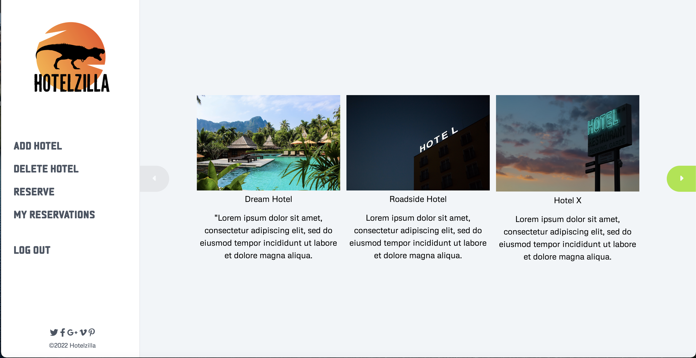
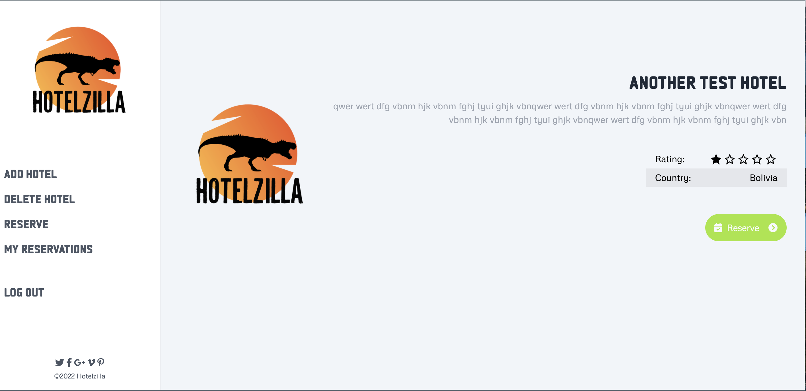
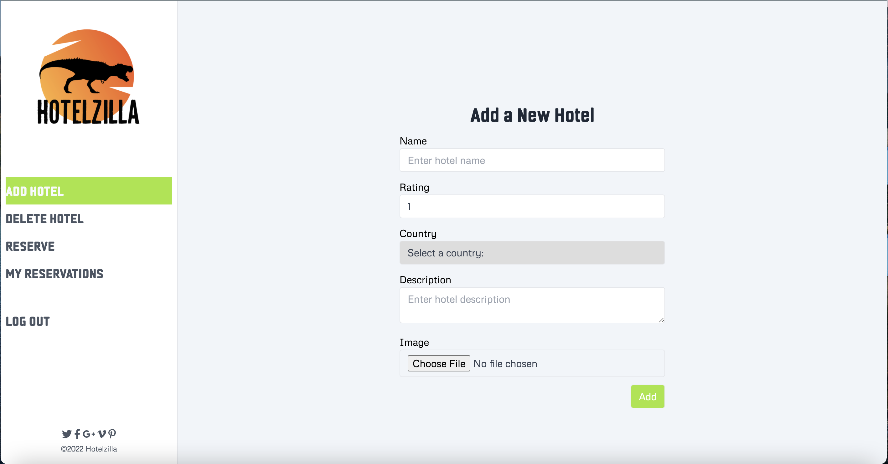
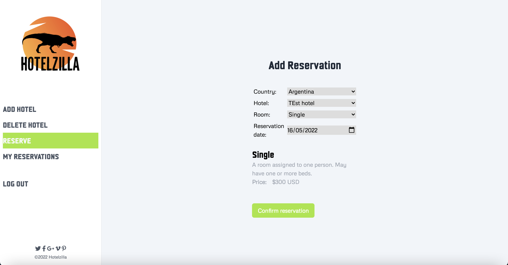
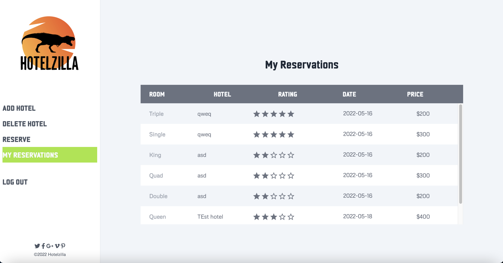

<h1>Hotelzilla</h1>

This web application is a hotel reservation app which allows users to:

- See all featured hotel rooms from the app's own external API
- See a detailed view of each room
- Sign up and sign in
- If the user is logged in they can reserve a room
- If the user is logged in they can see a list of all their reservations
- If the user is an admin they can add or delete hotel rooms

 

## 🧩 Built With

### Frontend
- Vite
- React.js
- Redux Toolkit
- Tailwind CSS

### Backend
- Ruby on Rails
- PostgreSQL

 

## Link to API

The API for this project was built with Ruby on Rails. For more information and the documentation, check out the [repository on Github](https://github.com/keroloussamy/Hotelzilla-api)

 

## 📸 Impressions
 

### Desktop Views:

### Mobile Views:

 

## 🚀 Live Demo Link

This project has been deployed with [Netlify](https://www.netlify.com/) and can be viewed [live here](https://hotelzilla.netlify.app/).

 

## 📚 Getting Started

To get a local copy up and running follow these simple example steps.

 

## Prerequisites

For this project you don't need any aditional tools to run it.
Be sure to have git set up on your local machine. If you are unfamiliar with the necessary steps, please find a step-by-step guide <a href="https://git-scm.com/book/en/v2/Getting-Started-First-Time-Git-Setup" rel="noopener noreferrer">here</a>

## Setup

Fork a copy to your repository and clone it locally:
 
`$ https://github.com/Anjacodes/Hotelzilla-UI.git`
 
`$ cd Hotelzilla-UI `

<h2>Install</h2>

Run `npm install` from your terminal window

<h2>Usage</h2>

You can now edit the code in your favorite Code Editor or view it in your browser.

<h2>Deployment</h2>

### `npm run dev`

Runs the app in the development mode.\
Open [http://localhost:3000](http://localhost:3000) to view it in your browser.

The page will reload when you make changes.\
You may also see any lint errors in the console.

### `npm run build`

Builds the app for production to the `build` folder.\
It correctly bundles React in production mode and optimizes the build for the best performance.

The build is minified and the filenames include the hashes.\
Your app is ready to be deployed!

See the section about [deployment](https://facebook.github.io/create-react-app/docs/deployment) for more information.

 

## Authors

👤 *Anja*

GitHub: [@Anjacodes]("https://github.com/Anjacodes") 
Twitter: [@Anja_Schmidt7]("https://twitter.com/Anja_Schmidt7") 
LinkedIn: [Anja Schmidt]("https://www.linkedin.com/in/anja-schmidt7/") 

 

👤 *George Magdy*

GitHub: [@George_Magdy](https://github.com/gemmen29) 
Twitter: [@George_Magdy](https://twitter.com/georgtriple1) 
LinkedIn: [@George_Magdy](https://www.linkedin.com/in/george-magdy-840/)

 

👤 *William Morales*

GitHub: [@williamrolando88](https://github.com/williamrolando88) 
Twitter: [@WillyMorales93](https://twitter.com/WillyMorales93) 
LinkedIn: [William Morales](https://www.linkedin.com/in/william-rolando-morales/)

 

## 🤝 Contributing

Contributions, issues, and feature requests are welcome!

Feel free to check the <a href="https://github.com/microverseinc/readme-template/issues" rel="noopener noreferrer">issues page</a>.

 

## Show your support

Give a ⭐️ if you like this project!

 

## Acknowledgments

Original design [Vespa](https://www.behance.net/gallery/26425031/Vespa-Responsive-Redesign/modules/173005583) by [Murat Korkmaz](https://www.behance.net/muratk) on [Behance](https://www.behance.net/)

 

<h2>📝 License</h2>

This project is <a href="https://github.com/microverseinc/readme-template/blob/master/MIT.md" rel="noopener noreferrer">MIT</a> licensed.

Copyright (c) 2022 William Rolando Morales, George Magdy, Anja Schmidt
